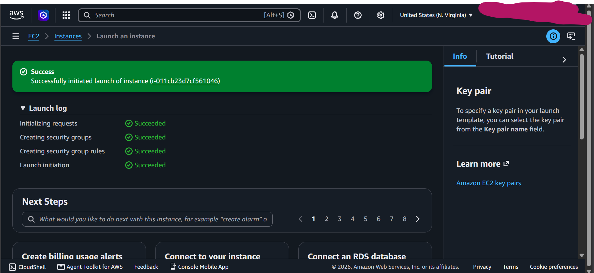
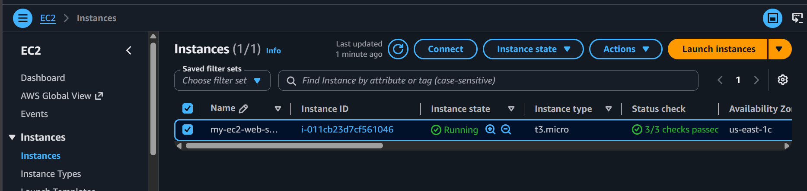
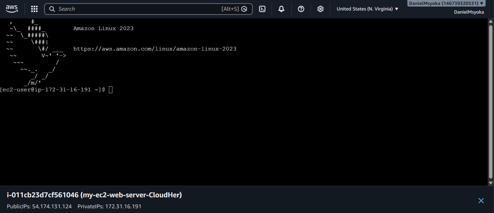
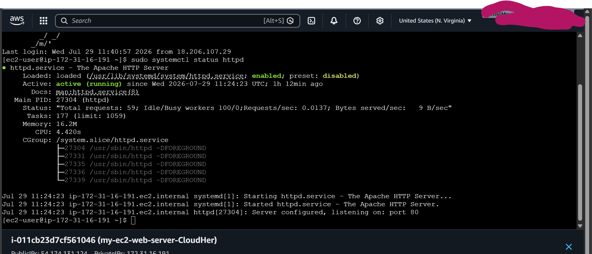
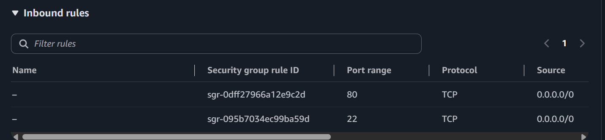
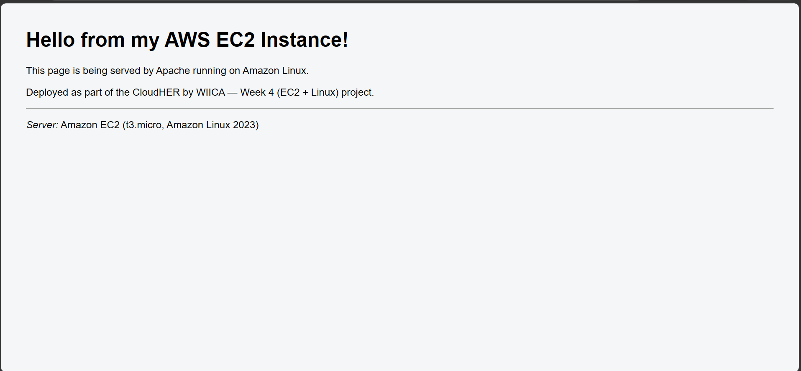

# AWS EC2 Apache Web Server Deployment

<p align="center">
  <strong>CloudHER by WIICA — Week 4 Project</strong><br>
  <em>EC2 + Linux Hands-on Lab</em>
</p>

---

## Table of Contents

- [Overview](#overview)
- [Architecture](#architecture)
- [Prerequisites](#prerequisites)
- [Step-by-Step Guide](#step-by-step-guide)
- [Troubleshooting Notes](#troubleshooting-notes)
- [Screenshots](#screenshots)
- [Skills Demonstrated](#skills-demonstrated)
- [What I Learned](#what-i-learned)
- [Author](#author)
- [Acknowledgements](#acknowledgements)
- [License](#license)

---

## Overview

This project provisions an Amazon EC2 instance running **Apache HTTP Server** and serves a custom HTML page from it.

It was a practical introduction to:
- Launching a virtual server in AWS
- Configuring networking and security groups
- Connecting securely via SSH
- Installing and managing services on Amazon Linux
- Deploying and testing web content

The goal was to gain confidence deploying a publicly accessible website on AWS using the command line.

---

## Architecture

```
Internet
   │
Internet Gateway
   │
   VPC
   │
Public Subnet
   │
EC2 Instance (Amazon Linux 2023, t3.micro)
   ├── Security Group
   │     • SSH  (port 22)  – Anywhere*
   │     • HTTP (port 80)  – Anywhere
   └── Apache (httpd) serving /var/www/html/index.html on port 80
```

> **Note:** SSH was temporarily opened to `0.0.0.0/0` to allow EC2 Instance Connect. See [Troubleshooting](#troubleshooting-notes) for the full explanation and recommended production practices.

---

## Prerequisites

- An AWS account (Free Tier eligible)
- Basic familiarity with the AWS Management Console
- A modern web browser
- *(Optional)* Local terminal with SSH client

---

## Step-by-Step Guide

Follow these steps in order to replicate this deployment.

### Step 1: Launch the EC2 Instance

1. Log in to the **AWS Management Console** and navigate to **EC2**.
2. Click **Launch Instance**.
3. Choose **Amazon Linux 2023** as the operating system.
4. Select the **t3.micro** instance type (Free Tier eligible).
5. Create a new **key pair** and download the `.pem` file. Store it securely — you cannot download it again.
6. Configure the **security group** with these inbound rules:

   | Type | Protocol | Port Range | Source |
   |------|----------|------------|--------|
   | SSH  | TCP      | 22         | `0.0.0.0/0` (Anywhere-IPv4) |
   | HTTP | TCP      | 80         | `0.0.0.0/0` (Anywhere-IPv4) |

7. Click **Launch Instance** and wait for the status to show **Running**.

> **Tip:** If using EC2 Instance Connect, SSH must be open to `0.0.0.0/0`. See the [Troubleshooting section](#troubleshooting-notes) for why.

---

### Step 2: Connect to the Instance

1. In the EC2 console, select your running instance.
2. Click **Connect** → **EC2 Instance Connect** tab.
3. Click **Connect** to open a browser-based SSH terminal.

You should now see a terminal prompt like:

```
[ec2-user@ip-xxx-xx-xx-xx ~]$
```

---

### Step 3: Update System Packages

Before installing anything, update the system's package list to get the latest versions.

```bash
sudo yum update -y
```

**What this does:**
- `sudo` — runs the command with administrator (root) privileges
- `yum` — the package manager for Amazon Linux
- `update` — checks for and installs available updates
- `-y` — automatically answers "yes" to any prompts

---

### Step 4: Install Apache HTTP Server

Install the Apache web server package (`httpd`).

```bash
sudo yum install -y httpd
```

**What this does:**
- `install` — tells yum to install a package
- `httpd` — the Apache HTTP Server package name on Amazon Linux
- `-y` — automatically confirms the installation

---

### Step 5: Start the Apache Service

Start the web server so it begins serving content.

```bash
sudo systemctl start httpd
```

**What this does:**
- `systemctl` — the command used to manage system services on Linux
- `start` — starts the service
- `httpd` — the name of the Apache service

---

### Step 6: Enable Apache to Start on Boot

Ensure Apache automatically starts every time the server reboots.

```bash
sudo systemctl enable httpd
```

**What this does:**
- `enable` — configures the service to start automatically at boot time

---

### Step 7: Verify Apache Is Running

Check the status of the Apache service to confirm it's active.

```bash
sudo systemctl status httpd
```

**What this does:**
- `status` — shows whether the service is running, stopped, or having issues

You should see output similar to:

```
● httpd.service - The Apache HTTP Server
     Loaded: loaded (/usr/lib/systemd/system/httpd.service; enabled; preset: disabled)
     Active: active (running) since ...
```

Look for **`active (running)`** — that means Apache is up and serving requests.

---

### Step 8: Create the Website Content

Apache serves files from `/var/www/html/`. Create a custom HTML page there.

```bash
sudo nano /var/www/html/index.html
```

Paste in your HTML content, for example:

```html
<!DOCTYPE html>
<html lang="en">
<head>
  <meta charset="UTF-8">
  <title>Dan's EC2 Project</title>
</head>
<body style="font-family: Arial, sans-serif; margin: 40px; background:#f4f6f8;">
  <h1>Hello from my AWS EC2 Instance!</h1>
  <p>This page is being served by Apache running on Amazon Linux.</p>
  <p>Deployed as part of the CloudHER by WIICA — Week 4 (EC2 + Linux) project.</p>
  <hr>
  <p><em>Server:</em> Amazon EC2 (t3.micro, Amazon Linux 2023)</p>
</body>
</html>
```

Save the file (`Ctrl+O`, then `Enter`, then `Ctrl+X` to exit nano).

---

### Step 9: Test the Website Locally

Before checking from the browser, test that Apache is serving the page from the server itself.

```bash
curl localhost
```

You should see your HTML content printed in the terminal. This confirms the server is working correctly.

---

### Step 10: Test Public Access

1. Go back to the **EC2 console** and copy your instance's **Public IPv4 address**.
2. Open a web browser and navigate to:

   ```
   http://<your-public-ip>
   ```

3. You should see your custom HTML page loaded in the browser.

> **If the page doesn't load**, check the [Troubleshooting section](#troubleshooting-notes) below.

---

## Troubleshooting Notes

Real issues encountered and how they were resolved:

### 1. EC2 Instance Connect Failed with "Error Establishing SSH Connection"

**Cause:** EC2 Instance Connect routes traffic through AWS-owned IP ranges, not the user's actual IP. A security group restricted to "My IP" blocks the connection.

**Fix:** Temporarily changed the SSH inbound rule source to `0.0.0.0/0` (Anywhere-IPv4).

**Production Recommendation:**
- Restrict SSH to the official [AWS Instance Connect IP ranges](https://docs.aws.amazon.com/AWSEC2/latest/UserGuide/ec2-instance-connect-set-up.html) for your region, **or**
- Prefer **AWS Systems Manager Session Manager** (no open SSH port required).

### 2. Website Timed Out in Browser Despite Apache Running Correctly

**Diagnostic Process** (worked outward from the server):

| Check | Result |
|-------|--------|
| Security Group (HTTP port 80, `0.0.0.0/0`) | Correct |
| Route table (`0.0.0.0/0` → Internet Gateway) | Correct |
| Network ACL (default allow-all) | Correct |
| `curl localhost` on the instance | Returned the page |
| `curl http://<public-ip>` from local terminal | Succeeded |

**Root Cause:** Brave browser Shields were interfering with the plain HTTP connection to a raw IP address.

**Fix:** Opened the same URL in Microsoft Edge — the page loaded immediately. No AWS-side changes were required.

**Key Lesson:** Always isolate issues systematically:

1. **Server** — `curl localhost`
2. **Network** — security groups, route tables, NACLs
3. **Client** — browser, firewall, extensions

---

## Screenshots

| Screenshot | Description |
|------------|-------------|
|  | Launch log showing all instance creation steps succeeded |
|  | EC2 console: instance state **Running**, 3/3 status checks passed |
|  | Browser-based SSH session successfully connected |
|  | `systemctl status httpd` showing **active (running)** |
|  | Inbound rules: SSH (22) and HTTP (80) |
|  | Custom page loading successfully at the instance's public IP |

---

## Skills Demonstrated

- **AWS EC2** — Instance provisioning (Free Tier)
- **Linux Administration** — Amazon Linux 2023 (`yum`, `systemctl`)
- **Web Server Management** — Apache HTTP Server installation and configuration
- **AWS Networking Fundamentals:**
  - VPC
  - Public subnets
  - Internet Gateway
  - Route tables
  - Security Groups
  - Network ACLs
- **Systematic Cloud Troubleshooting** — Server → Network → Client isolation
- **Secure Remote Access** — Patterns and trade-offs

---

## What I Learned

Through this project I learned how to:

- Launch and connect to an EC2 instance using EC2 Instance Connect
- Install and manage a web server with `systemctl`
- Configure security groups for HTTP and SSH access
- Deploy static content to Apache's document root
- Diagnose common connectivity problems methodically
- Understand why "My IP" rules can break Instance Connect

---

## Author

**Daniel Nzioki Musyoka**  

[](https://github.com/Daniel059)
[](https://www.linkedin.com/in/daniel-nzioki-musyoka)

---

## Acknowledgements

This project was completed as part of the **CloudHER by WIICA Week 4 Cloud Computing Assignment**, which focuses on introducing learners to cloud technologies and practical AWS deployment skills.

Special thanks to my mentor **Rajpreet Gill** for her guidance and support throughout my CloudHER journey. Her mentorship helped me deepen my understanding of **AWS and Cloud Computing**, and gave me valuable insights into building and deploying cloud-based solutions.

| Organization | Link |
|--------------|------|
| Women Innovating in Cloud Africa (WIICA) | [LinkedIn](https://www.linkedin.com/company/wiica/) |
| Rajpreet Gill (Mentor) | [LinkedIn](https://www.linkedin.com/in/rajpreet-gill-devop/) |

---

## License

This project is intended for educational and portfolio purposes.

---

> **💡 Tip for future me:** Always start troubleshooting from the inside (`curl localhost`) and work outward. It saves hours of guessing.
